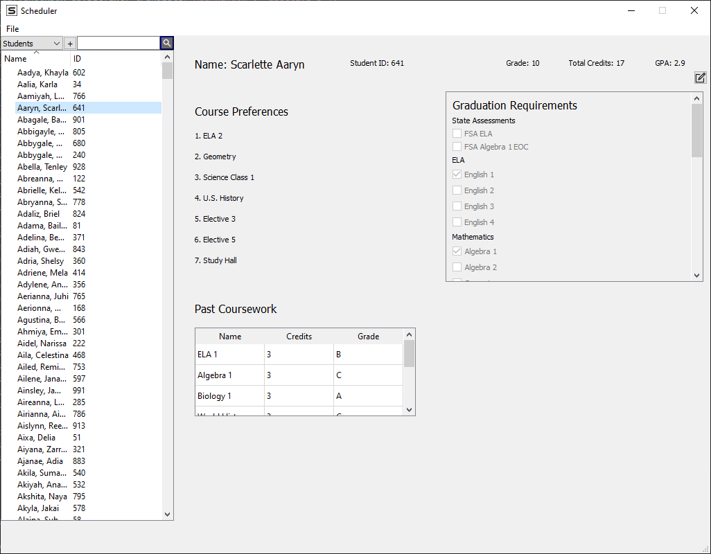

# School Scheduler

School Scheduler is a utility designed to help High School administrator create student, teacher, and classroom schedules. This task is usually done by hand or in unoptimized programs such as excel. We leverage the computational power of a computer to check thousands of potential schedules per second.

 
## Features

- Bulk Import/Export of Student Schedules: Easily import a large number of student schedules in bulk, eliminating the need for manual data entry.
- Graduation Requirement Tracking: The software analyzes student course selections and progress to recommend schedules that fulfill graduation requirements.
- Intuitive User Interface: The UI is designed to be accessible and efficient, reducing the time and effort required to manage scheduling tasks.
- Schedule Optimization: School Scheduler utilizes powerful optimization algorithms to generate and refine schedules. By considering factors such as student preferences, teacher availability, and classroom capacities, the software creates balanced and efficient schedules.

## Tech Stack

- **Python3**: The core programming language used for developing School Scheduler. Python offers simplicity, readability, and a vast ecosystem of libraries, making it an excellent choice for rapid development.
- **PyQt5**: A Python binding for the Qt toolkit, PyQt5 is used for building the graphical user interface of School Scheduler. PyQt5 provides a powerful set of tools and widgets for creating responsive and intuitive UIs.
- **SQLAlchemy**: A popular SQL toolkit and Object-Relational Mapping (ORM) library for Python. SQLAlchemy simplifies database interactions and provides a seamless integration with different database systems. In School Scheduler, SQLAlchemy is used to interact with the underlying SQLite database.
- **Rust**: Rust is a systems programming language that emphasizes performance, memory safety, and concurrency. While not the primary language used in School Scheduler, Rust is utilized for optimizing critical components and implementing computationally intensive algorithms.
- **SQLite**: A lightweight and self-contained relational database management system. SQLite is used as the database engine for School Scheduler, providing a reliable and efficient storage solution for student, teacher, and classroom data.

## Getting Started

To get a local copy of the project up and running, follow these steps:

1. Clone the repository:

   ```bash
   git clone https://github.com/navidali/SchoolScheduler.git

2. Install dependencies:

   ```bash
    cd SchoolScheduler
    pip install SchoolSchedulerApp

3. Run the app:
    ```bash
    python main.py

## Contributors

Justin Miller

Julian Berrio

Navid Ali

Megan Quinn

Michael Berry